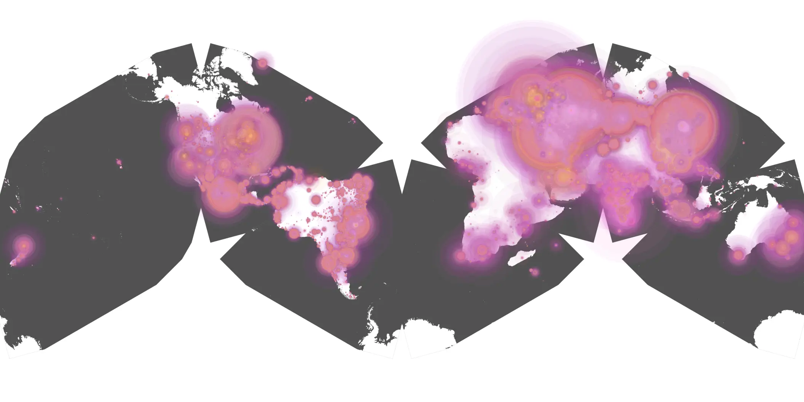
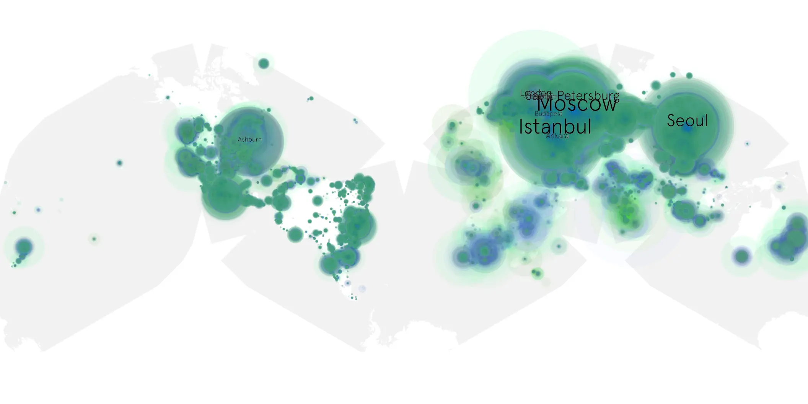

# penguin-101 sample cache audit

## 1. Media object

| Field | Value |
| --- | --- |
| Media object | The Penguin |
| Collection key | `penguin-101` |
| imdb_id | [tt15435876](https://www.imdb.com/title/tt15435876/) |
| wikipedia_url | [The Penguin (TV series)](https://en.wikipedia.org/wiki/The_Penguin_(TV_series)) |
| Sample dates | 2024-09-20-to-2025-03-20 |
| Sample days | 182 |
| BTIH count | 344 |
| Unique BTIH count | 316 |
| Downloaders total | 50,019,922 |
| Uploaders total | 3,400,610 |
| Data version | `2026-08-05` |
| IP geolocation version | `6:1777968300` |

## 2. Coverage report

- Generated: 2026-08-28T21:12:10Z
- Sample archive directory: `/run/media/bkoz/gold/src/alpha60-samples-raw.gold/penguin-101.xz`
- Hour directories: 4343
- Zero-length sample files: 0
- Other unparsable sample files: 0
- Hourly discontinuities: 1 (7 missing hours)
- Missing days: 0

### Sample archive discontinuities

- hourly gap: last `2024-11-29 10:00`, resumed `2024-11-29 18:00` — missing 7 hour(s)

## 3. File sizes histogram *median[lowest, highest]*

## 4. Graphs

### Downloads by week cumulative (normalized start)



### Downloads by day, Saturday and Sunday in gray

## 5. Cumulative Maps

<!-- https://raw.githubusercontent.com/alpha60-devops/alpha60-results-2024/refs/heads/main/data/ -->

### <a href="https://raw.githubusercontent.com/alpha60-devops/alpha60-results-2024/refs/heads/main/data/geojson.cumulative/penguin-101-cumulative-aggregate.geojson.gz" data-map-title="The Penguin — penguin-101" onclick="leaflet_map_open_window(this.href, this.dataset.mapTitle); return false;" class="table-link" aria-label="Open The Penguin (penguin-101) cumulative data map in new window" title="Opens interactive map for The Penguin (penguin-101) data">Swarm Detail</a>

### Geographic Regions

| Africa | Americas | Asia | Europe | Oceania | Unknown |
| --- | --- | --- | --- | --- | --- |
| 2.09 | 15.30 | 26.58 | 52.98 | 1.01 | 0.52 |

### Network infrastructure

{:target="_blank" rel="noopener"}

### Resolution >= 1080p

{:target="_blank" rel="noopener"}

### Resolution < 1080p

{:target="_blank" rel="noopener"}
