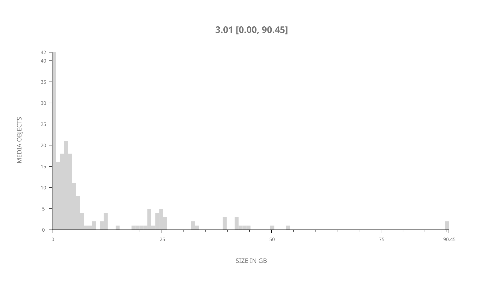
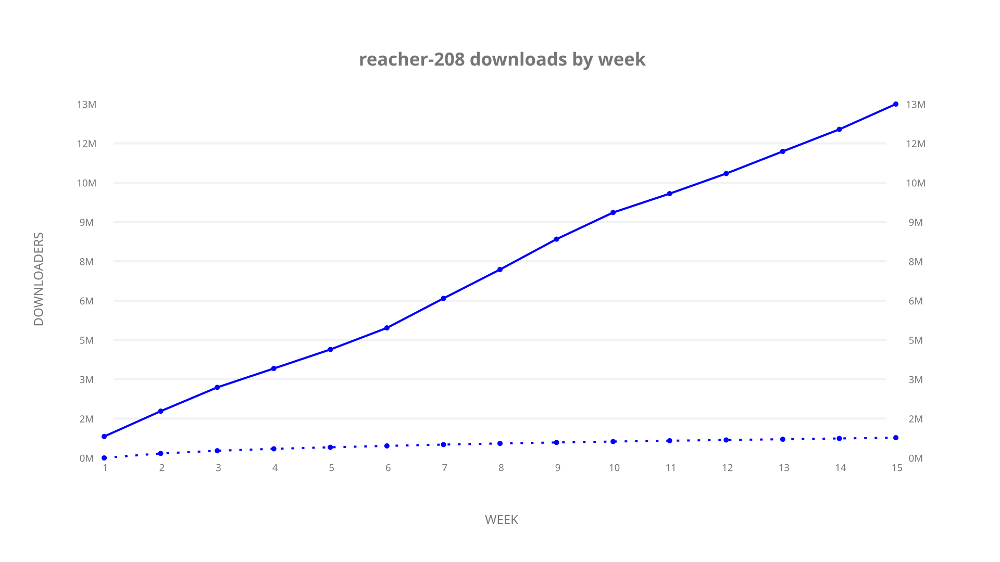
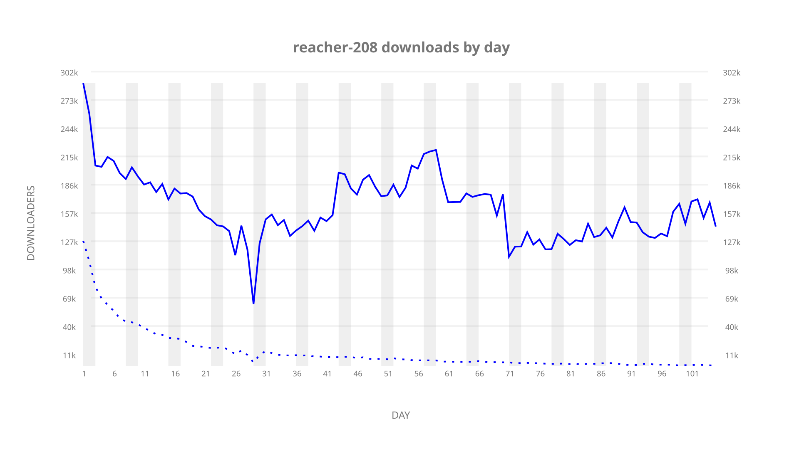
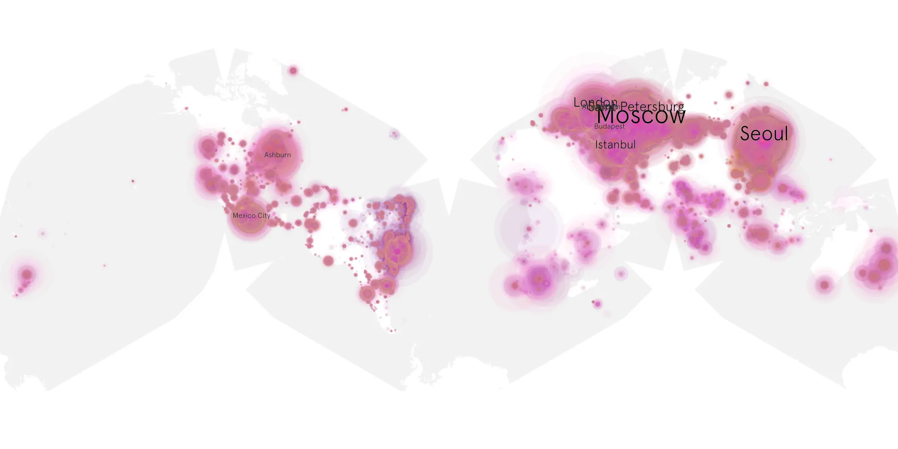
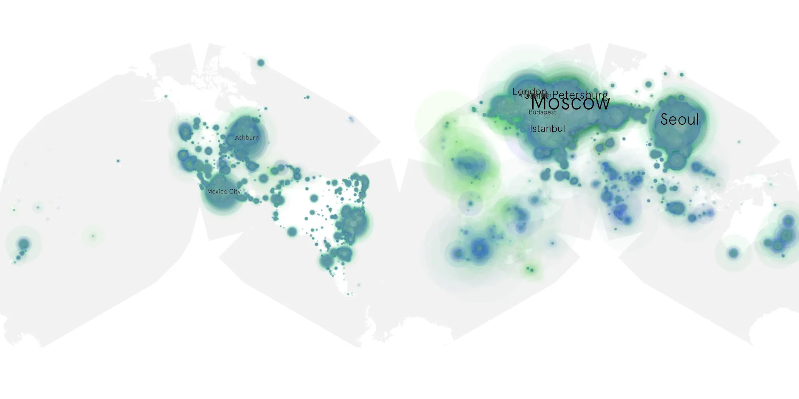

# reacher-208 sample cache audit

## 1. Media object

| Field | Value |
| --- | --- |
| Media object | Reacher |
| Collection key | `reacher-208` |
| imdb_id | [tt9288030](https://www.imdb.com/title/tt9288030/) |
| wikipedia_url | UNAVAILABLE |
| Sample dates | 2024-01-19-to-2024-05-02 |
| Sample days | 105 (2024–2024) |
| BTIH count | 214 |
| Unique BTIH count | 187 |
| Downloaders total | 14,379,318 |
| Uploaders total | 1,488,524 |
| Data version | `2026-08-05` |
| IP geolocation version | `6:1777968300` |

## 2. Cache coverage report

- Generated: 2026-08-28T21:17:50Z
- Sample archive directory: `/run/media/bkoz/gold/src/alpha60-samples-raw.gold/reacher-208.xz`
- Hour directories: 2500
- Zero-length sample files: 0
- Other unparsable sample files: 0
- Hourly discontinuities: 3 (19 missing hours)
- Missing days: 0

### Sample archive discontinuities

- hourly gap: last `2024-02-12 23:03`, resumed `2024-02-13 07:03` — missing 7 hour(s)
- hourly gap: last `2024-02-16 19:03`, resumed `2024-02-17 07:06` — missing 11 hour(s)
- hourly gap: last `2024-03-31 01:06`, resumed `2024-03-31 03:06` — missing 1 hour(s)

## 3. Collection size histogram

## 4. Visualization pass — graphs

### Downloads by week cumulative (normalized start)

### Downloads by day, Saturday and Sunday in gray

## 5. Visualization pass — maps

### Continental downloader slices

| Africa | Americas | Asia | Europe | Oceania | Unknown |
| --- | --- | --- | --- | --- | --- |
| 2.93 | 19.01 | 22.35 | 50.63 | 1.25 | 0.56 |

### Cumulative network infrastructure

{:target="_blank" rel="noopener"}

### Cumulative data maps

**Cumulative >= 1080p**

**Cumulative < 1080p**

