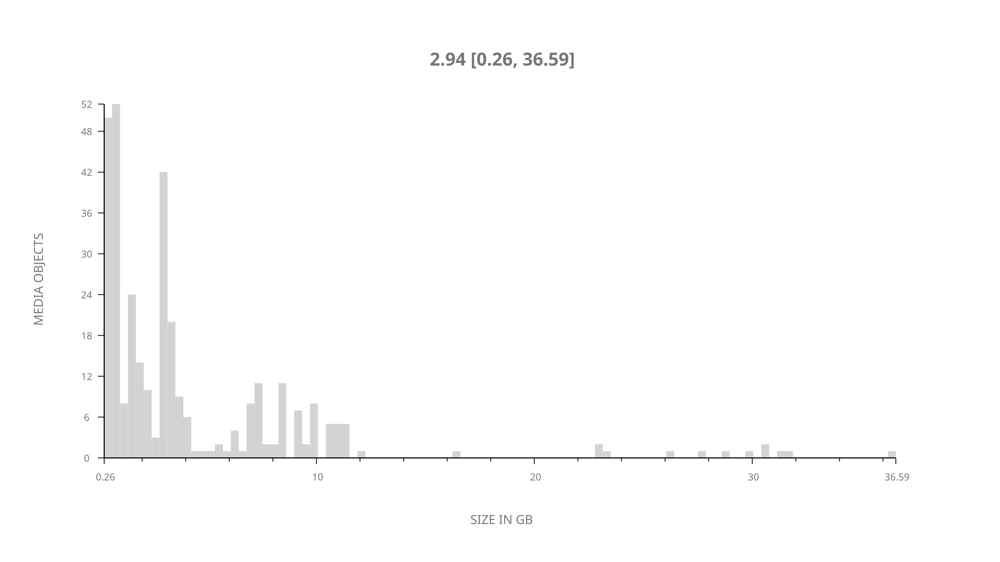
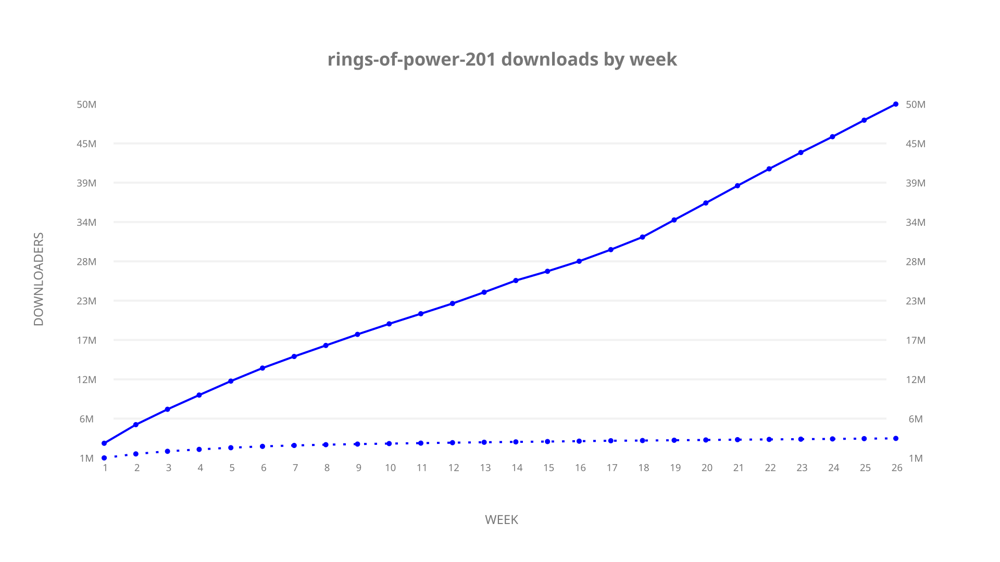
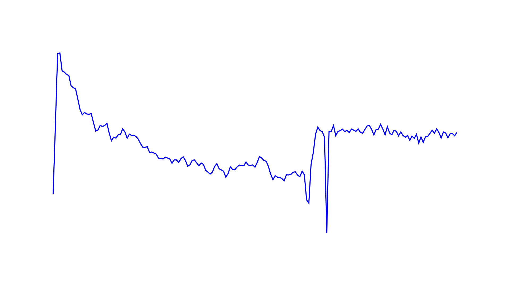
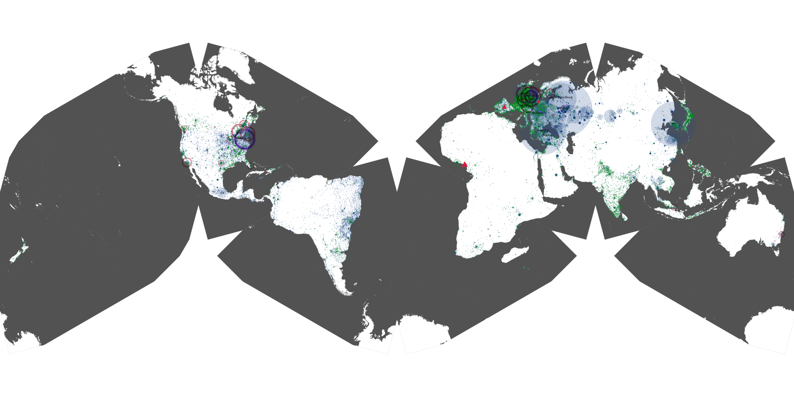
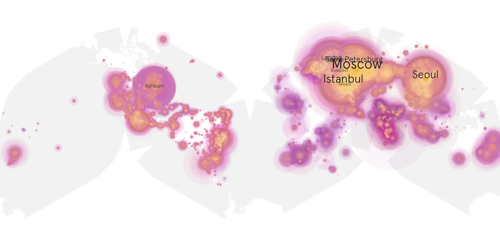
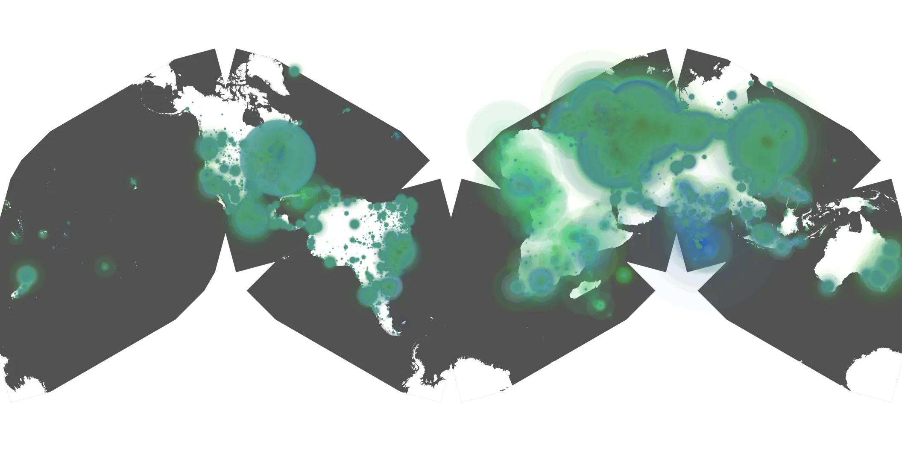

# rings-of-power-201 sample cache audit

## 1. Media object

| Field | Value |
| --- | --- |
| Media object | Rings of Power |
| Collection key | `rings-of-power-201` |
| imdb_id | [tt7631058](https://www.imdb.com/title/tt7631058/) |
| wikipedia_url | UNAVAILABLE |
| Sample dates | 2024-08-29-to-2025-02-26 |
| Sample days | 182 (2024–2025) |
| BTIH count | 339 |
| Unique BTIH count | 329 |
| Downloaders total | 51,462,049 |
| Uploaders total | 4,041,923 |
| Data version | `2026-08-05` |
| IP geolocation version | `6:1777968300` |

## 2. Cache coverage report

- Generated: 2026-08-28T21:22:31Z
- Sample archive directory: `/run/media/bkoz/gold/src/alpha60-samples-raw.gold/rings-of-power-201.xz`
- Hour directories: 4302
- Zero-length sample files: 0
- Other unparsable sample files: 0
- Hourly discontinuities: 3 (49 missing hours)
- Missing days: 1

### Sample archive discontinuities

- hourly gap: last `2024-12-12 22:00`, resumed `2024-12-13 00:00` — missing 1 hour(s)
- hourly gap: last `2024-12-28 22:00`, resumed `2024-12-30 22:00` — missing 47 hour(s)
- hourly gap: last `2025-01-19 22:00`, resumed `2025-01-20 00:00` — missing 1 hour(s)
- missing day: `2024-12-29`

## 3. Collection size histogram

## 4. Visualization pass — graphs

### Downloads by week cumulative (normalized start)

### Downloads by day, Saturday and Sunday in gray

## 5. Visualization pass — maps

### Continental downloader slices

| Africa | Americas | Asia | Europe | Oceania | Unknown |
| --- | --- | --- | --- | --- | --- |
| 2.59 | 15.39 | 26.45 | 52.60 | 1.08 | 0.54 |

### Cumulative network infrastructure

{:target="_blank" rel="noopener"}

### Cumulative data maps

**Cumulative >= 1080p**

**Cumulative < 1080p**

