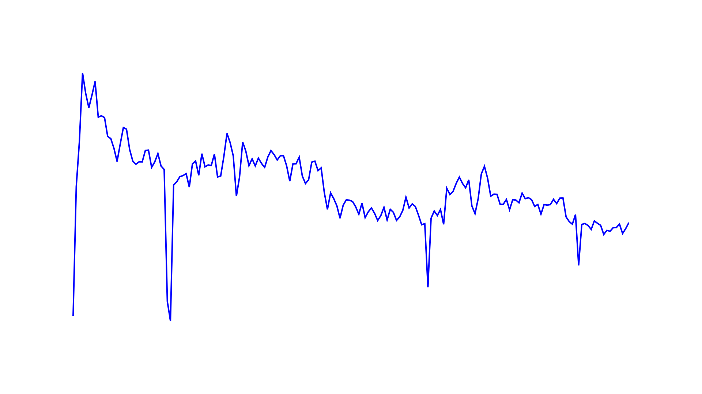
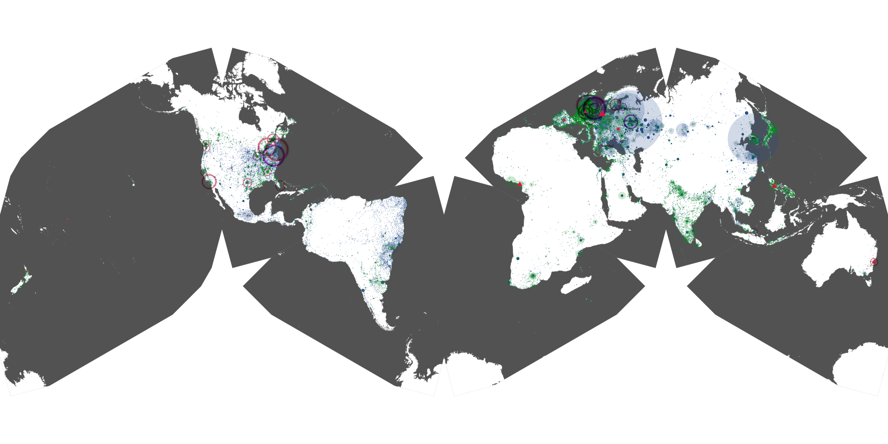
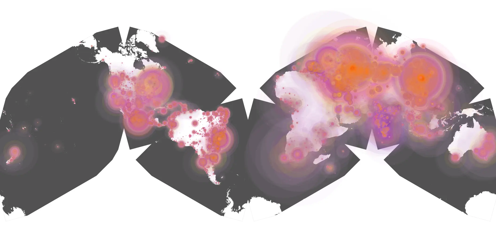
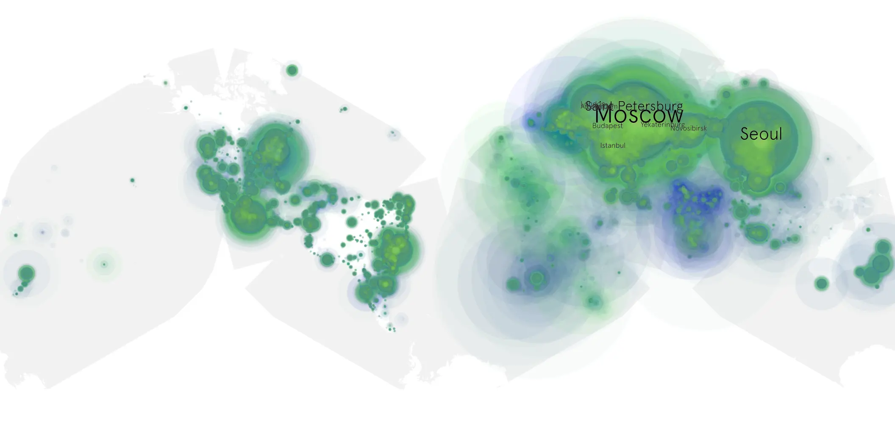

# road-house-2024 sample cache audit

## 1. Media object

| Field | Value |
| --- | --- |
| Media object | Road House 2024 |
| Collection key | `road-house-2024` |
| imdb_id | [tt3359350](https://www.imdb.com/title/tt3359350/) |
| wikipedia_url | [Road House (2024 film)](https://en.wikipedia.org/wiki/Road_House_(2024_film)) |
| Sample dates | 2024-03-21-to-2024-09-18 |
| Sample days | 182 |
| BTIH count | 322 |
| Unique BTIH count | 264 |
| Downloaders total | 51,053,418 |
| Uploaders total | 6,047,114 |
| Data version | `2026-08-05` |
| IP geolocation version | `6:1777968300` |

## 2. Coverage report

- Generated: 2026-08-28T21:27:57Z
- Sample archive directory: `/run/media/bkoz/gold/src/alpha60-samples-raw.gold/road-house-2024.xz`
- Hour directories: 4298
- Zero-length sample files: 0
- Other unparsable sample files: 0
- Hourly discontinuities: 5 (51 missing hours)
- Missing days: 0

### Sample archive discontinuities

- hourly gap: last `2024-03-31 01:03`, resumed `2024-03-31 03:03` — missing 1 hour(s)
- hourly gap: last `2024-04-20 06:03`, resumed `2024-04-21 00:03` — missing 17 hour(s)
- hourly gap: last `2024-04-21 00:03`, resumed `2024-04-21 23:37` — missing 22 hour(s)
- hourly gap: last `2024-05-22 22:03`, resumed `2024-05-23 00:03` — missing 1 hour(s)
- hourly gap: last `2024-07-15 12:03`, resumed `2024-07-15 23:20` — missing 10 hour(s)

## 3. File sizes histogram *median[lowest, highest]*

## 4. Graphs

### Downloads by week cumulative (normalized start)



### Downloads by day, Saturday and Sunday in gray

## 5. Cumulative Maps

<!-- https://raw.githubusercontent.com/alpha60-devops/alpha60-results-2024/refs/heads/main/data/ -->

### <a href="https://raw.githubusercontent.com/alpha60-devops/alpha60-results-2024/refs/heads/main/data/geojson.cumulative/road-house-2024-cumulative-aggregate.geojson.gz" data-map-title="Road House 2024 — road-house-2024" onclick="leaflet_map_open_window(this.href, this.dataset.mapTitle); return false;" class="table-link" aria-label="Open Road House 2024 (road-house-2024) cumulative data map in new window" title="Opens interactive map for Road House 2024 (road-house-2024) data">Swarm Detail</a>

### Geographic Regions

| Africa | Americas | Asia | Europe | Oceania | Unknown |
| --- | --- | --- | --- | --- | --- |
| 2.66 | 16.34 | 24.46 | 51.83 | 1.02 | 0.65 |

### Network infrastructure

{:target="_blank" rel="noopener"}

### Resolution >= 1080p

{:target="_blank" rel="noopener"}

### Resolution < 1080p

{:target="_blank" rel="noopener"}
