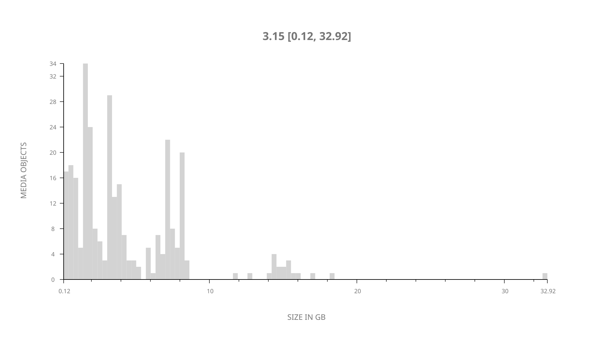
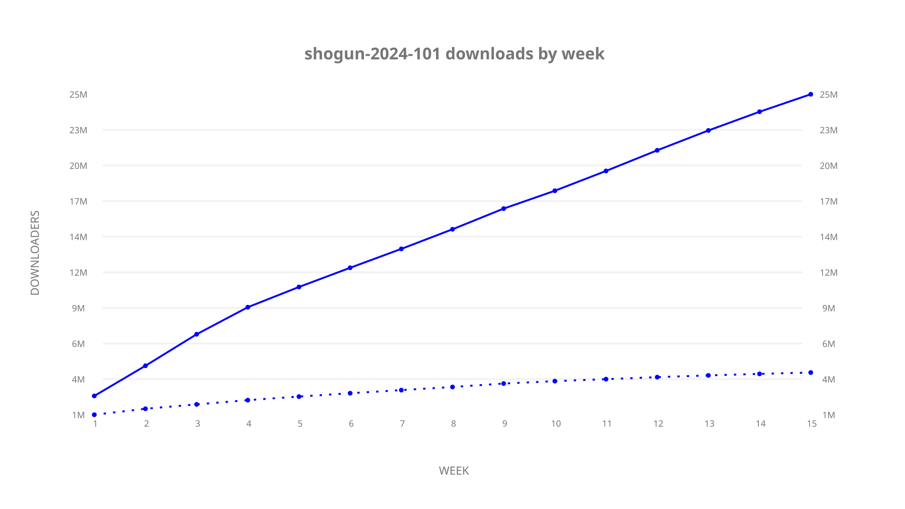
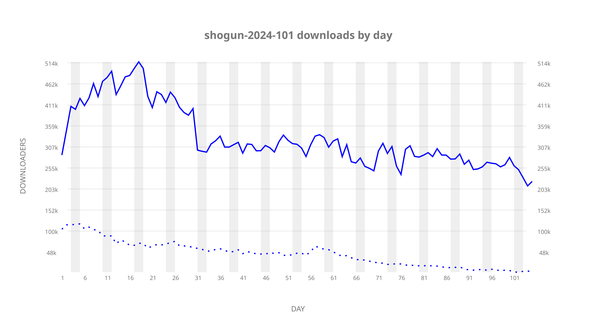
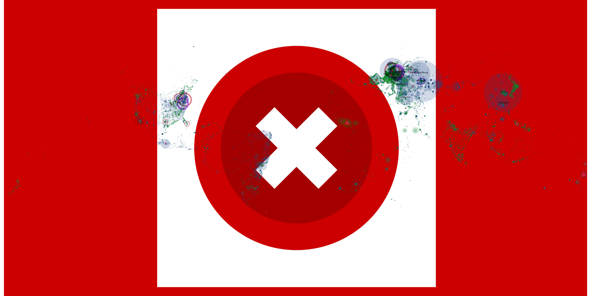

# shogun-2024-101 sample cache audit

## 1. Media object

| Field | Value |
| --- | --- |
| Media object | Shogun 2024 |
| Collection key | `shogun-2024-101` |
| imdb_id | [tt2788316](https://www.imdb.com/title/tt2788316/) |
| wikipedia_url | UNAVAILABLE |
| Sample dates | 2024-02-28-to-2024-06-11 |
| Sample days | 105 (2024–2024) |
| BTIH count | 326 |
| Unique BTIH count | 297 |
| Downloaders total | 26,600,880 |
| Uploaders total | 4,342,033 |
| Data version | `2026-08-05` |
| IP geolocation version | `6:1777968300` |

## 2. Cache coverage report

UNAVAILABLE: no sample archive on this host.

## 3. Collection size histogram

## 4. Visualization pass — graphs

### Downloads by week cumulative (normalized start)

### Downloads by day, Saturday and Sunday in gray

## 5. Visualization pass — maps

### Continental downloader slices

| Africa | Americas | Asia | Europe | Oceania | Unknown |
| --- | --- | --- | --- | --- | --- |
| 3.35 | 18.06 | 23.03 | 49.61 | 1.52 | 0.60 |

### Cumulative network infrastructure

{:target="_blank" rel="noopener"}

UNAVAILABLE — no cumulative data maps were rendered.
