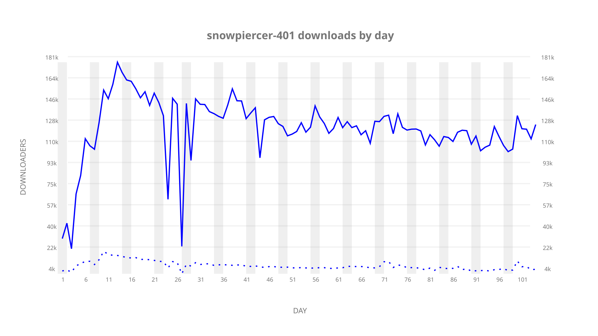
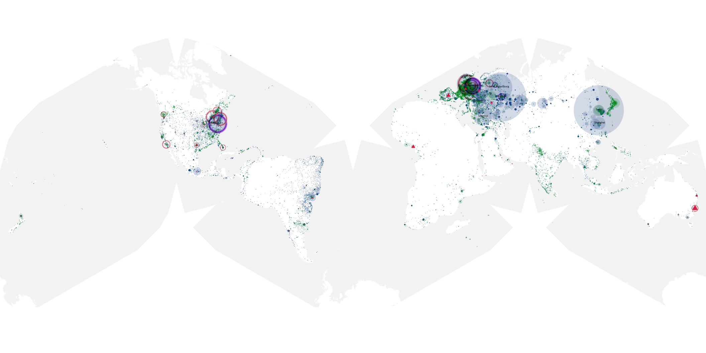
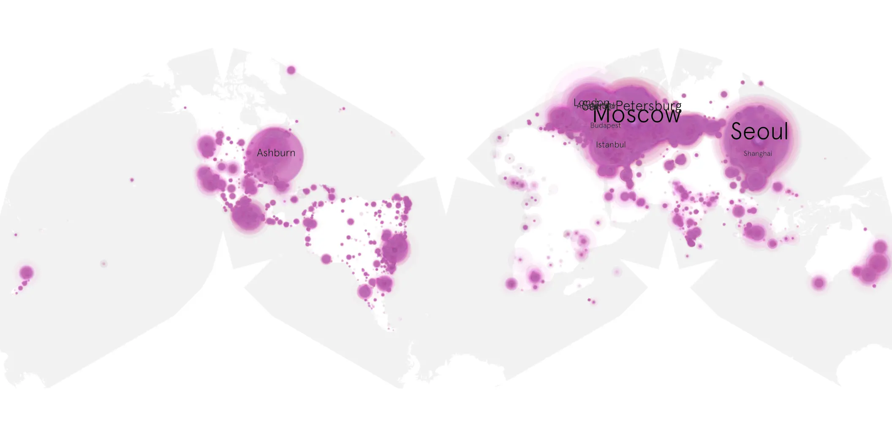
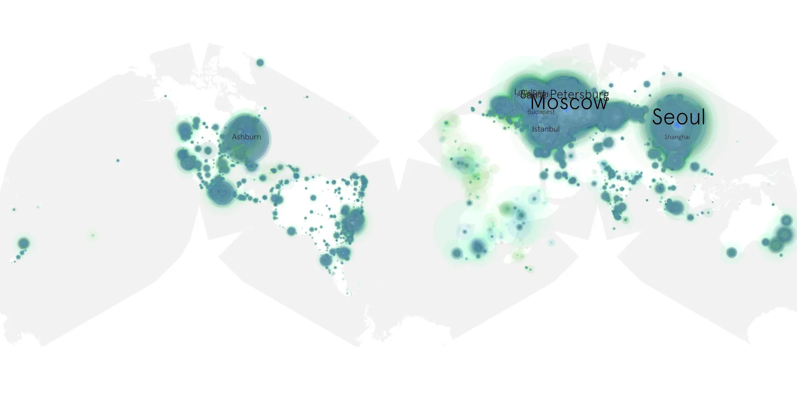

# snowpiercer-401 sample cache audit

## 1. Media object

| Field | Value |
| --- | --- |
| Media object | Snowpiercer |
| Collection key | `snowpiercer-401` |
| imdb_id | [tt6156584](https://www.imdb.com/title/tt6156584/) |
| wikipedia_url | [Snowpiercer (TV series)](https://en.wikipedia.org/wiki/Snowpiercer_(TV_series)) |
| Sample dates | 2024-07-20-to-2024-11-01 |
| Sample days | 105 |
| BTIH count | 159 |
| Unique BTIH count | 141 |
| Downloaders total | 10,455,239 |
| Uploaders total | 573,304 |
| Data version | `2026-08-05` |
| IP geolocation version | `6:1777968300` |

## 2. Sample coverage report

- Generated: 2026-08-28T21:44:43Z
- Sample archive directory: `/run/media/bkoz/gold/src/alpha60-samples-raw.gold/snowpiercer-401.xz`
- Hour directories: 2422
- Zero-length sample files: 0
- Other unparsable sample files: 0
- Hourly discontinuities: 6 (95 missing hours)
- Missing days: 1

### Sample archive discontinuities

- hourly gap: last `2024-07-21 22:00`, resumed `2024-07-22 19:00` — missing 20 hour(s)
- hourly gap: last `2024-08-11 22:00`, resumed `2024-08-12 15:00` — missing 16 hour(s)
- hourly gap: last `2024-08-12 22:00`, resumed `2024-08-13 00:00` — missing 1 hour(s)
- hourly gap: last `2024-08-14 22:00`, resumed `2024-08-16 22:00` — missing 47 hour(s)
- hourly gap: last `2024-08-17 22:00`, resumed `2024-08-18 09:00` — missing 10 hour(s)
- hourly gap: last `2024-08-18 22:00`, resumed `2024-08-19 00:00` — missing 1 hour(s)
- missing day: `2024-08-15`

## 3. Media objects file size histogram

## 4. Visualization pass — graphs

### Downloads by week cumulative (normalized start)



### Downloads by day, Saturday and Sunday in gray

## 5. Visualization pass — maps

### Cumulative geographic slices

| Africa | Americas | Asia | Europe | Oceania | Unknown |
| --- | --- | --- | --- | --- | --- |
| 1.75 | 16.22 | 25.58 | 51.59 | 1.22 | 0.65 |

### Cumulative network infrastructure

{:target="_blank" rel="noopener"}

### Cumulative data maps

**Cumulative >= 1080p**

{:target="_blank" rel="noopener"}

**Cumulative < 1080p**

{:target="_blank" rel="noopener"}
