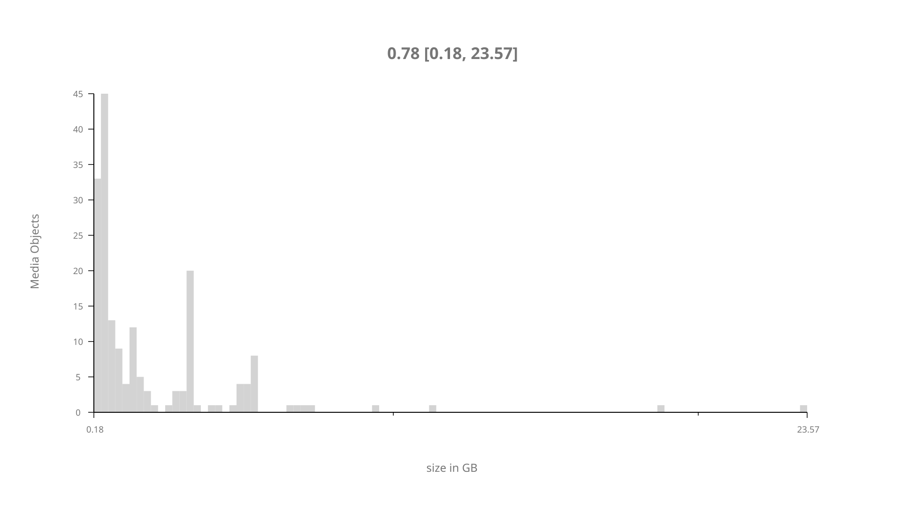
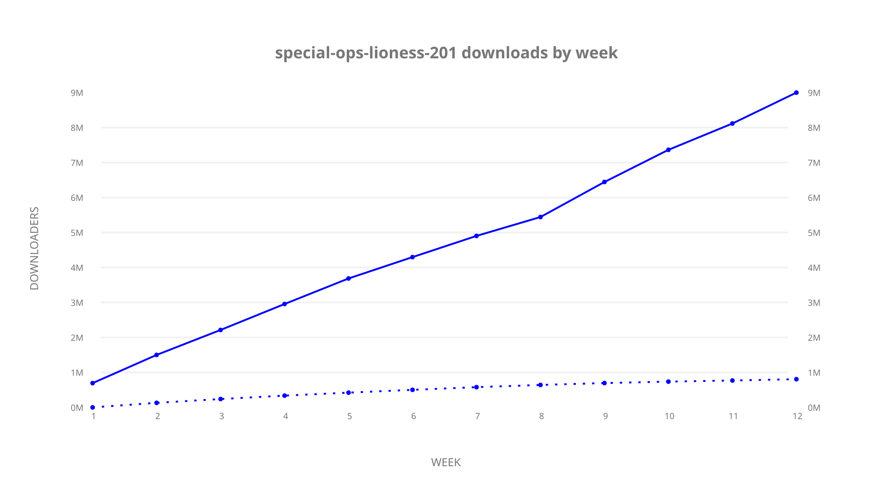
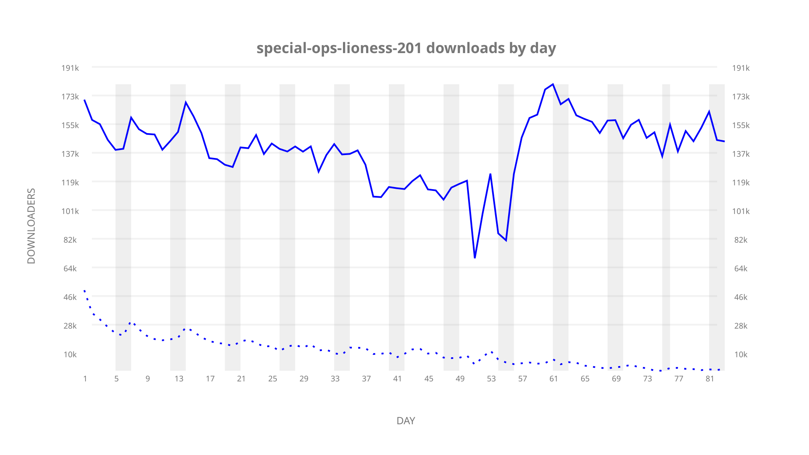
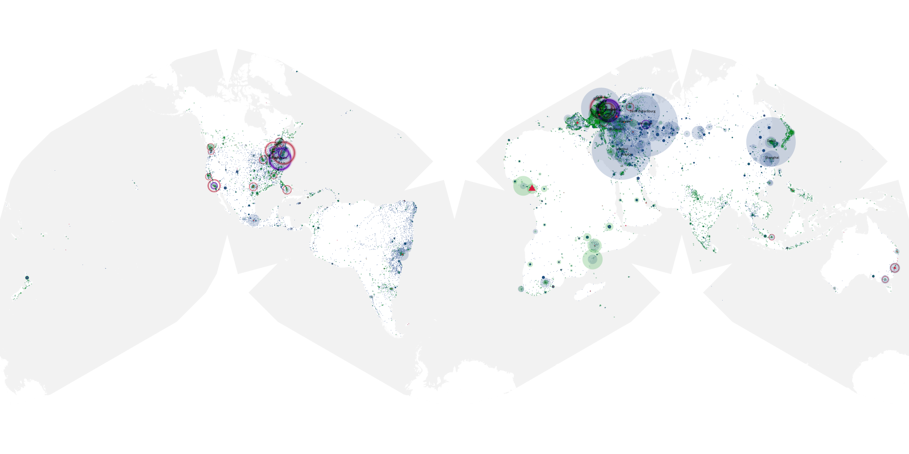
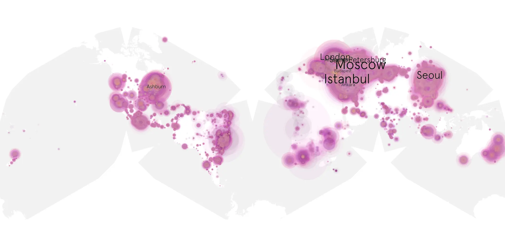
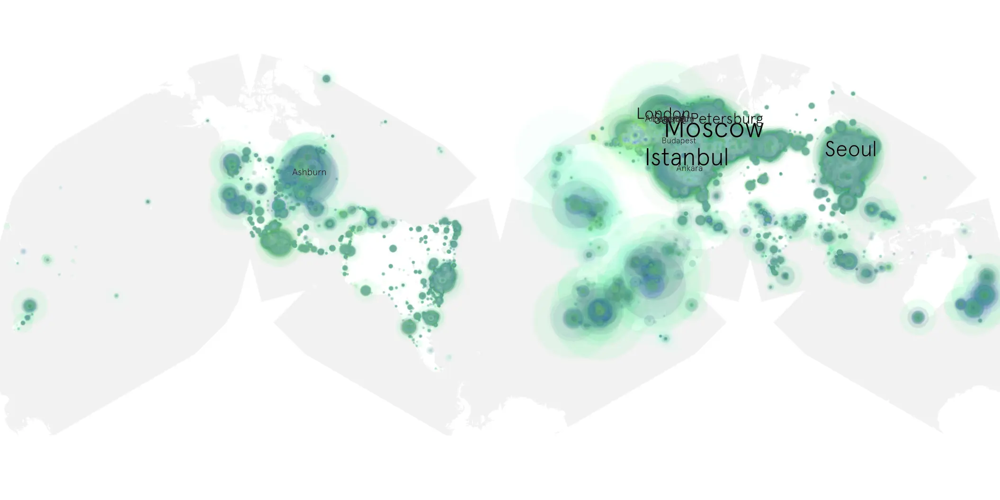

# special-ops-lioness-201 sample cache audit

## 1. Media object

| Field | Value |
| --- | --- |
| Media object | Special Ops Lioness |
| Collection key | `special-ops-lioness-201` |
| imdb_id | [tt13111078](https://www.imdb.com/title/tt13111078/) |
| wikipedia_url | UNAVAILABLE |
| Sample dates | 2024-10-28-to-2025-01-19 |
| Sample days | 84 (2024–2025) |
| BTIH count | 197 |
| Unique BTIH count | 180 |
| Downloaders total | 9,642,159 |
| Uploaders total | 1,138,908 |
| Data version | `2026-08-05` |
| IP geolocation version | `6:1777968300` |

## 2. Cache coverage report

- Generated: 2026-08-28T21:44:51Z
- Sample archive directory: `/run/media/bkoz/gold/src/alpha60-samples-raw.gold/special-ops-lioness-201.xz`
- Hour directories: 2492
- Zero-length sample files: 0
- Other unparsable sample files: 0
- Hourly discontinuities: 1 (25 missing hours)
- Missing days: 1

### Sample archive discontinuities

- hourly gap: last `2025-01-10 22:03`, resumed `2025-01-12 00:54` — missing 25 hour(s)
- missing day: `2025-01-11`

## 3. Collection size histogram

## 4. Visualization pass — graphs

### Downloads by week cumulative (normalized start)

### Downloads by day, Saturday and Sunday in gray

## 5. Visualization pass — maps

### Continental downloader slices

| Africa | Americas | Asia | Europe | Oceania | Unknown |
| --- | --- | --- | --- | --- | --- |
| 4.92 | 17.21 | 23.09 | 48.78 | 1.54 | 0.48 |

### Cumulative network infrastructure

{:target="_blank" rel="noopener"}

### Cumulative data maps

**Cumulative >= 1080p**

**Cumulative < 1080p**

