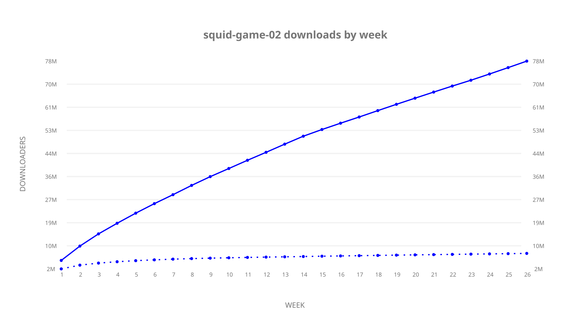
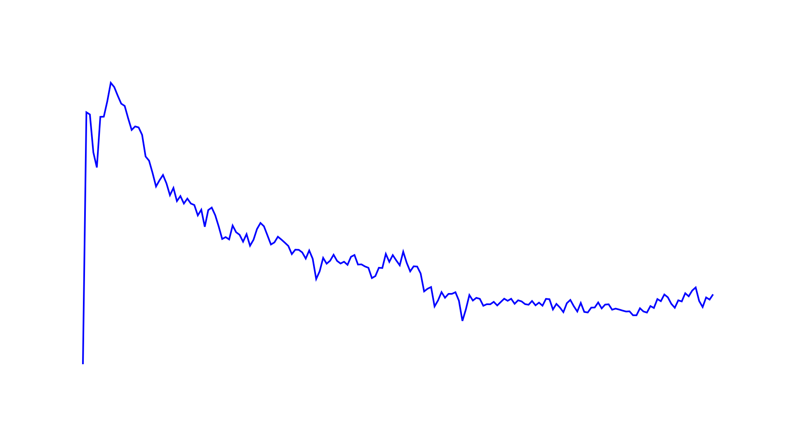
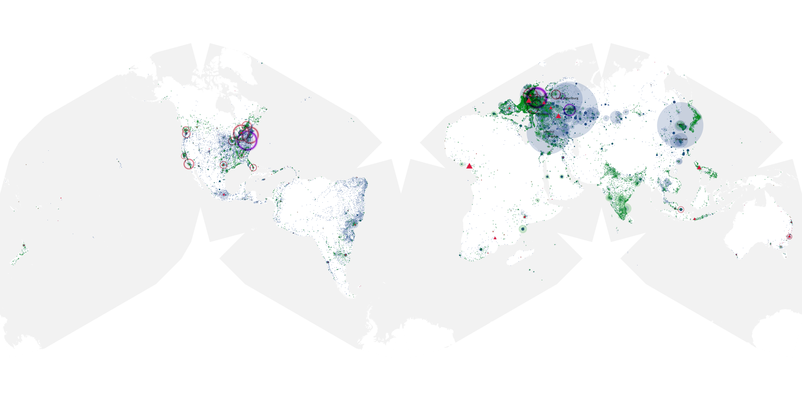
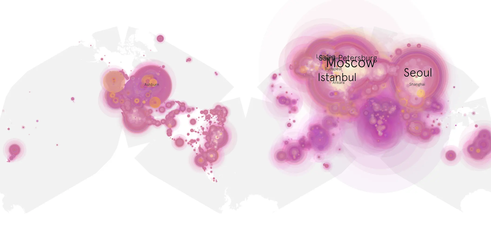
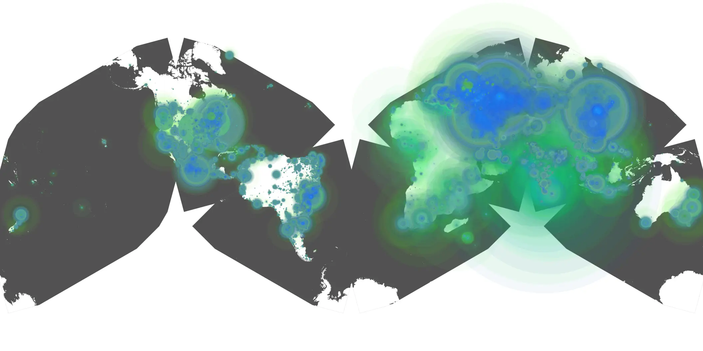

# squid-game-02 sample cache audit

## 1. Media object

| Field | Value |
| --- | --- |
| Media object | Squid Game |
| Collection key | `squid-game-02` |
| imdb_id | [tt10919420](https://www.imdb.com/title/tt10919420/) |
| wikipedia_url | UNAVAILABLE |
| Sample dates | 2024-12-26-to-2025-06-25 |
| Sample days | 182 (2024–2025) |
| BTIH count | 587 |
| Unique BTIH count | 547 |
| Downloaders total | 83,047,019 |
| Uploaders total | 8,886,379 |
| Data version | `2026-08-05` |
| IP geolocation version | `6:1777968300` |

## 2. Cache coverage report

- Generated: 2026-08-28T21:47:35Z
- Sample archive directory: `/run/media/bkoz/gold/src/alpha60-samples-raw.gold/squid-game-02.xz`
- Hour directories: 4346
- Zero-length sample files: 0
- Other unparsable sample files: 0
- Hourly discontinuities: 2 (2 missing hours)
- Missing days: 0

### Sample archive discontinuities

- hourly gap: last `2025-03-19 22:06`, resumed `2025-03-20 00:06` — missing 1 hour(s)
- hourly gap: last `2025-03-30 01:06`, resumed `2025-03-30 03:06` — missing 1 hour(s)

## 3. Collection size histogram

## 4. Visualization pass — graphs

### Downloads by week cumulative (normalized start)

### Downloads by day, Saturday and Sunday in gray

## 5. Visualization pass — maps

### Continental downloader slices

| Africa | Americas | Asia | Europe | Oceania | Unknown |
| --- | --- | --- | --- | --- | --- |
| 2.37 | 14.18 | 29.12 | 51.01 | 0.92 | 0.54 |

### Cumulative network infrastructure

{:target="_blank" rel="noopener"}

### Cumulative data maps

**Cumulative >= 1080p**

**Cumulative < 1080p**

