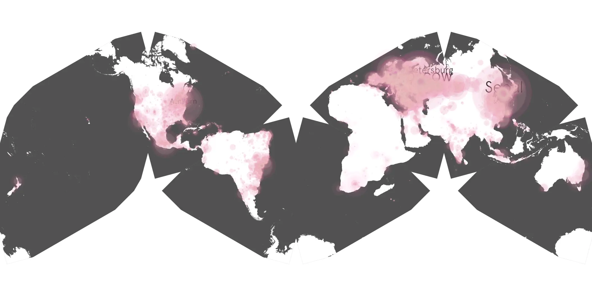
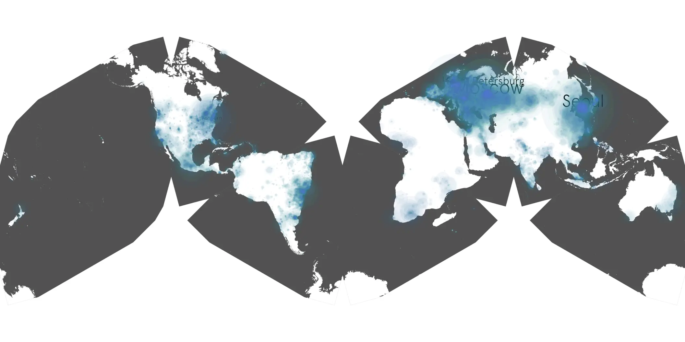

# stormy sample cache audit

## 1. Media object

| Field | Value |
| --- | --- |
| Media object | Stormy |
| Collection key | `stormy` |
| imdb_id | [tt31169602](https://www.imdb.com/title/tt31169602/) |
| wikipedia_url | [Stormy (2024 film)](https://en.wikipedia.org/wiki/Stormy_(2024_film)) |
| Sample dates | 2024-03-18-to-2024-09-15 |
| Sample days | 182 |
| BTIH count | 18 |
| Unique BTIH count | 17 |
| Downloaders total | 1,604,415 |
| Uploaders total | 43,151 |
| Data version | `2026-08-05` |
| IP geolocation version | `6:1777968300` |

## 2. Coverage report

- Generated: 2026-08-28T21:48:02Z
- Sample archive directory: `/run/media/bkoz/gold/src/alpha60-samples-raw.gold/stormy.xz`
- Hour directories: 4255
- Zero-length sample files: 0
- Other unparsable sample files: 0
- Hourly discontinuities: 7 (96 missing hours)
- Missing days: 1

### Sample archive discontinuities

- hourly gap: last `2024-03-31 01:00`, resumed `2024-03-31 03:00` — missing 1 hour(s)
- hourly gap: last `2024-07-21 22:00`, resumed `2024-07-22 19:00` — missing 20 hour(s)
- hourly gap: last `2024-08-11 22:00`, resumed `2024-08-12 15:00` — missing 16 hour(s)
- hourly gap: last `2024-08-12 22:00`, resumed `2024-08-13 00:00` — missing 1 hour(s)
- hourly gap: last `2024-08-14 22:00`, resumed `2024-08-16 22:00` — missing 47 hour(s)
- hourly gap: last `2024-08-17 22:00`, resumed `2024-08-18 09:00` — missing 10 hour(s)
- hourly gap: last `2024-08-18 22:00`, resumed `2024-08-19 00:00` — missing 1 hour(s)
- missing day: `2024-08-15`

## 3. File sizes histogram *median[lowest, highest]*

## 4. Graphs

### Downloads by week cumulative (normalized start)



### Downloads by day, Saturday and Sunday in gray

## 5. Cumulative Maps

<!-- https://raw.githubusercontent.com/alpha60-devops/alpha60-results-2024/refs/heads/main/data/ -->

### <a href="https://raw.githubusercontent.com/alpha60-devops/alpha60-results-2024/refs/heads/main/data/geojson.cumulative/stormy-cumulative-aggregate.geojson.gz" data-map-title="Stormy — stormy" onclick="leaflet_map_open_window(this.href, this.dataset.mapTitle); return false;" class="table-link" aria-label="Open Stormy (stormy) cumulative data map in new window" title="Opens interactive map for Stormy (stormy) data">Swarm Detail</a>

### Geographic Regions

| Africa | Americas | Asia | Europe | Oceania | Unknown |
| --- | --- | --- | --- | --- | --- |
| 1.46 | 16.40 | 21.19 | 42.65 | 0.91 | 0.56 |

### Network infrastructure

{:target="_blank" rel="noopener"}

### Resolution >= 1080p

{:target="_blank" rel="noopener"}

### Resolution < 1080p

{:target="_blank" rel="noopener"}
