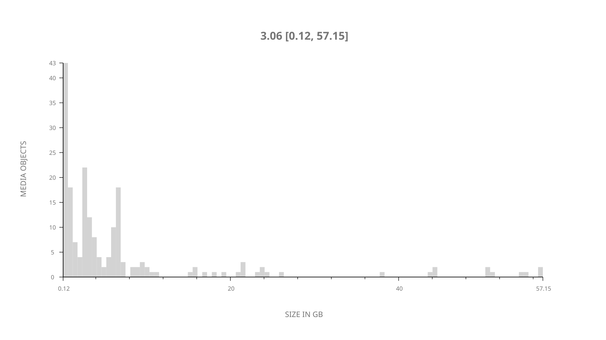
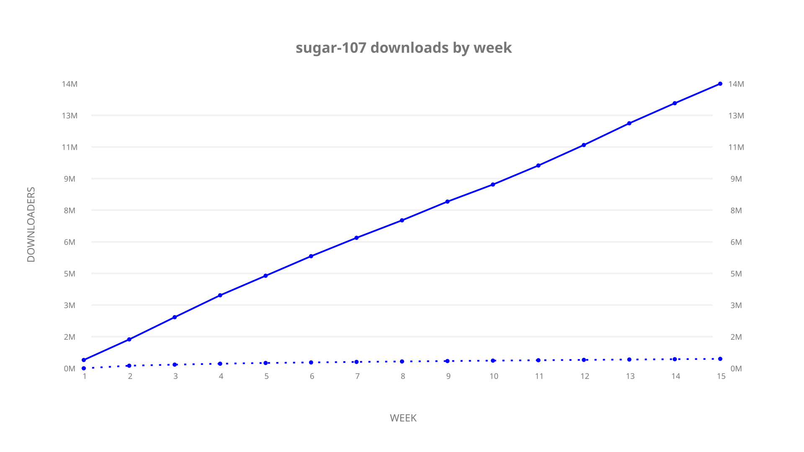
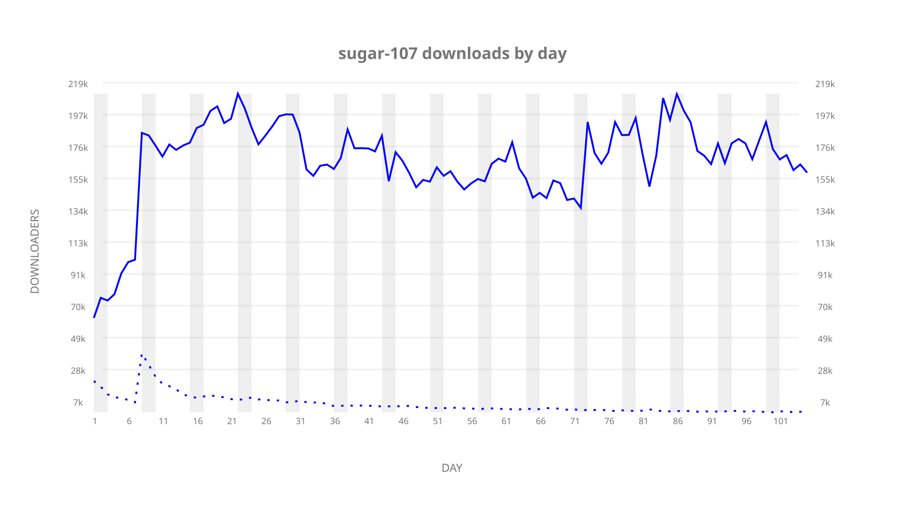
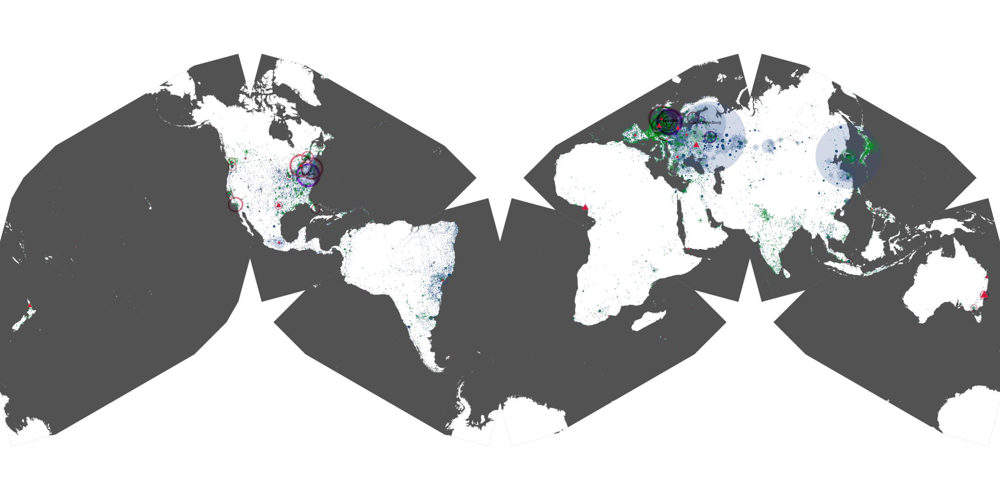

# sugar-107 sample cache audit

## 1. Media object

| Field | Value |
| --- | --- |
| Media object | Sugar |
| Collection key | `sugar-107` |
| imdb_id | [tt16418808](https://www.imdb.com/title/tt16418808/) |
| wikipedia_url | UNAVAILABLE |
| Sample dates | 2024-05-10-to-2024-08-22 |
| Sample days | 105 (2024–2024) |
| BTIH count | 210 |
| Unique BTIH count | 192 |
| Downloaders total | 14,701,207 |
| Uploaders total | 644,232 |
| Data version | `2026-08-05` |
| IP geolocation version | `6:1777968300` |

## 2. Cache coverage report

UNAVAILABLE: no sample archive on this host.

## 3. Collection size histogram

## 4. Visualization pass — graphs

### Downloads by week cumulative (normalized start)

### Downloads by day, Saturday and Sunday in gray

## 5. Visualization pass — maps

### Continental downloader slices

| Africa | Americas | Asia | Europe | Oceania | Unknown |
| --- | --- | --- | --- | --- | --- |
| 1.18 | 18.39 | 24.37 | 52.44 | 1.12 | 0.71 |

### Cumulative network infrastructure

{:target="_blank" rel="noopener"}

UNAVAILABLE — no cumulative data maps were rendered.
