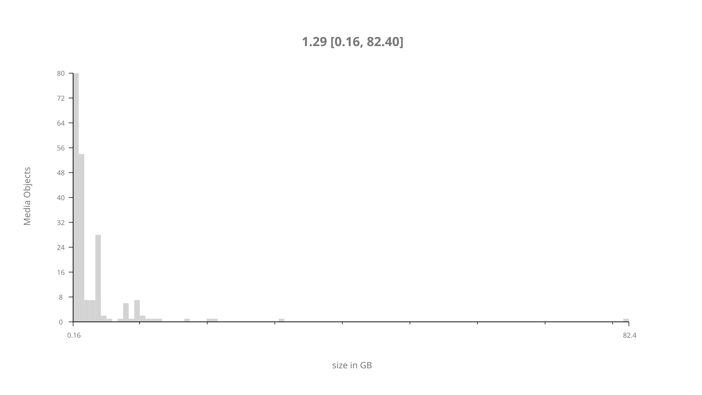
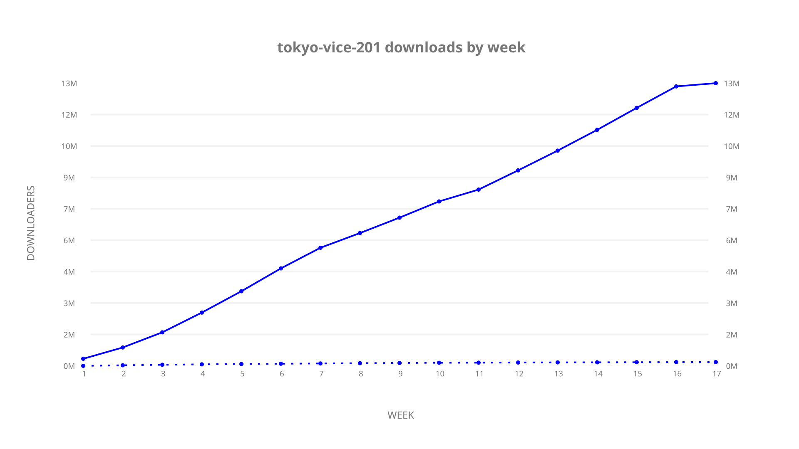
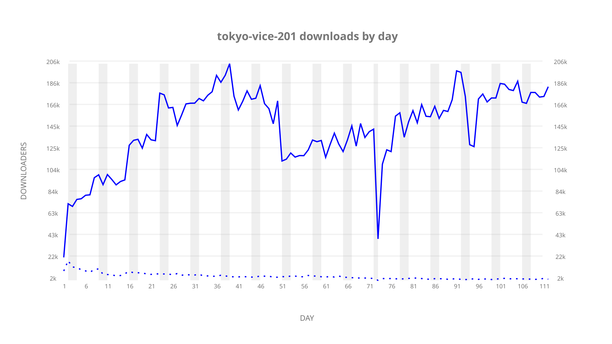
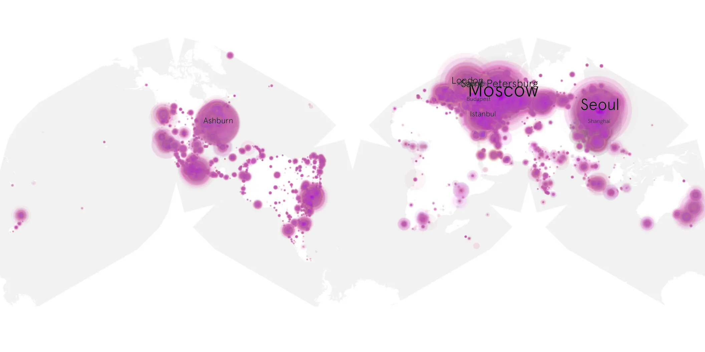
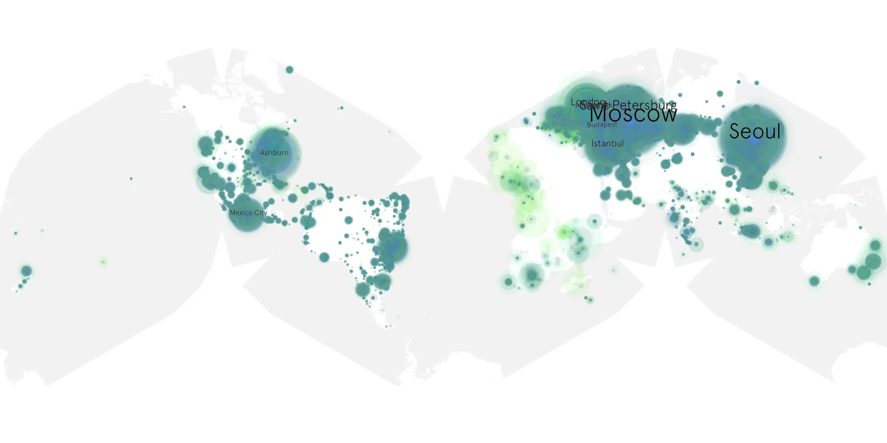

# tokyo-vice-201 sample cache audit

## 1. Media object

| Field | Value |
| --- | --- |
| Media object | Tokyo Vice |
| Collection key | `tokyo-vice-201` |
| imdb_id | [tt2887954](https://www.imdb.com/title/tt2887954/) |
| wikipedia_url | UNAVAILABLE |
| Sample dates | 2024-02-08-to-2024-05-30 |
| Sample days | 113 (2024–2024) |
| BTIH count | 219 |
| Unique BTIH count | 204 |
| Downloaders total | 13,471,085 |
| Uploaders total | 248,946 |
| Data version | `2026-08-05` |
| IP geolocation version | `6:1777968300` |

## 2. Cache coverage report

- Generated: 2026-08-28T21:53:04Z
- Sample archive directory: `/run/media/bkoz/gold/src/alpha60-samples-raw.gold/tokyo-vice-201.xz`
- Hour directories: 2652
- Zero-length sample files: 0
- Other unparsable sample files: 0
- Hourly discontinuities: 2 (42 missing hours)
- Missing days: 1

### Sample archive discontinuities

- hourly gap: last `2024-03-31 01:00`, resumed `2024-03-31 03:00` — missing 1 hour(s)
- hourly gap: last `2024-04-20 06:00`, resumed `2024-04-22 00:00` — missing 41 hour(s)
- missing day: `2024-04-21`

## 3. Collection size histogram

## 4. Visualization pass — graphs

### Downloads by week cumulative (normalized start)

### Downloads by day, Saturday and Sunday in gray

## 5. Visualization pass — maps

### Continental downloader slices

| Africa | Americas | Asia | Europe | Oceania | Unknown |
| --- | --- | --- | --- | --- | --- |
| 1.32 | 19.01 | 23.56 | 52.67 | 1.06 | 0.64 |

### Cumulative network infrastructure

{:target="_blank" rel="noopener"}

### Cumulative data maps

**Cumulative >= 1080p**

**Cumulative < 1080p**

