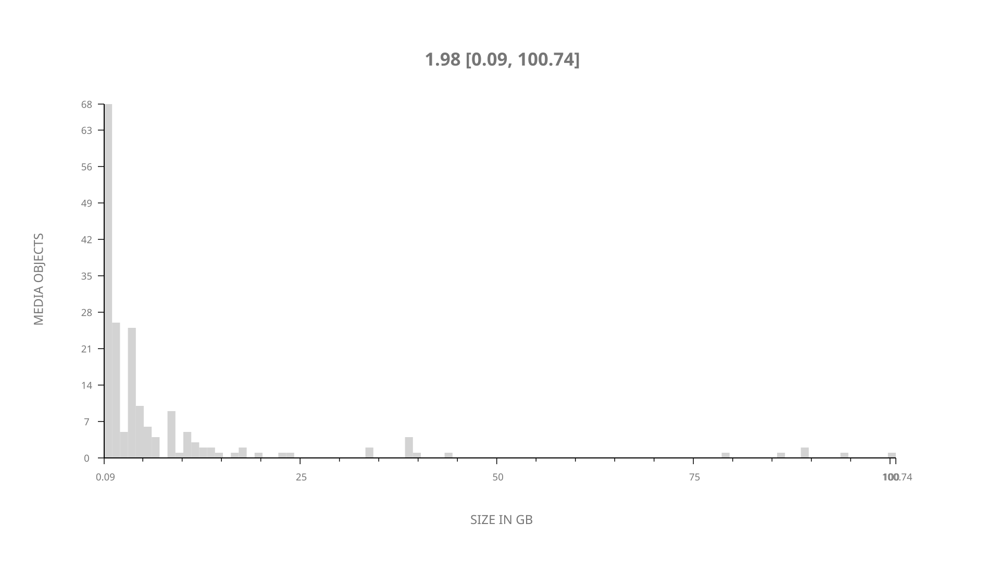
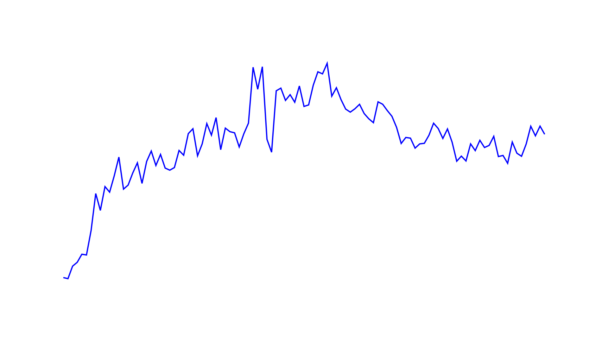
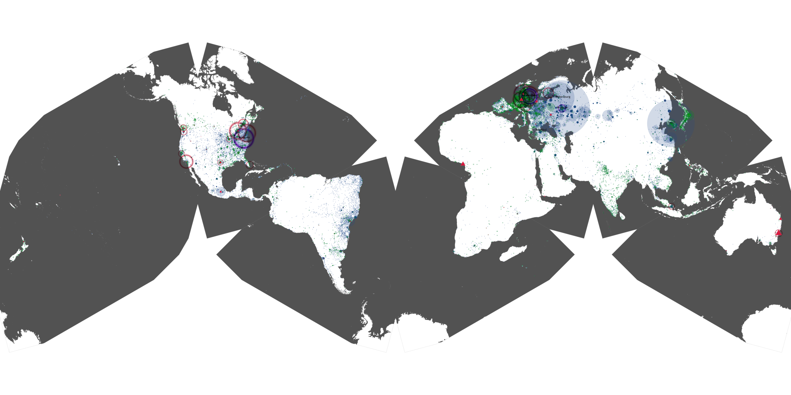
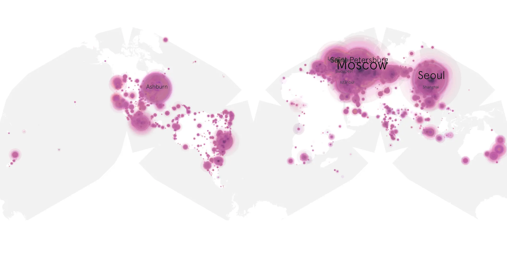
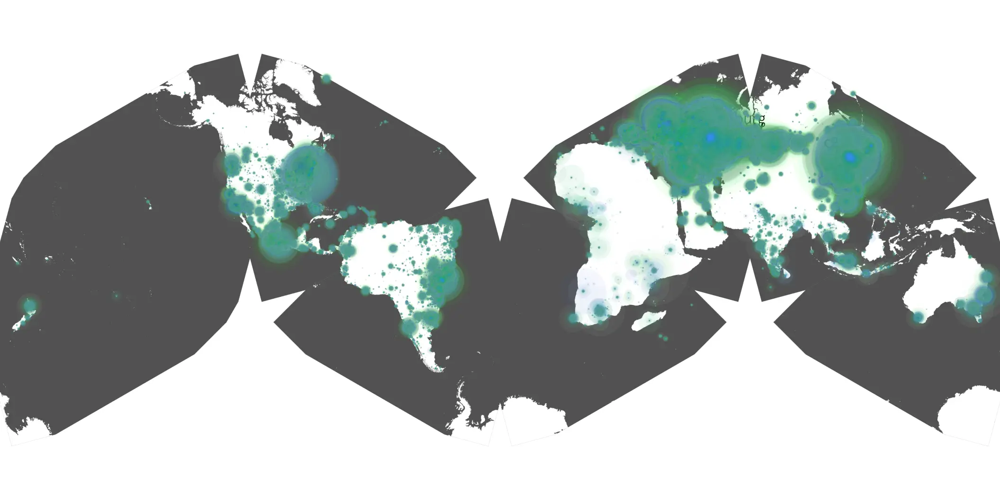

# tokyo-vice-209 sample cache audit

## 1. Media object

| Field | Value |
| --- | --- |
| Media object | Tokyo Vice |
| Collection key | `tokyo-vice-209` |
| imdb_id | [tt2887954](https://www.imdb.com/title/tt2887954/) |
| wikipedia_url | [Tokyo Vice (TV series)](https://en.wikipedia.org/wiki/Tokyo_Vice_(TV_series)) |
| Sample dates | 2024-03-29-to-2024-07-11 |
| Sample days | 105 |
| BTIH count | 210 |
| Unique BTIH count | 187 |
| Downloaders total | 13,573,893 |
| Uploaders total | 367,276 |
| Data version | `2026-08-05` |
| IP geolocation version | `6:1777968300` |

## 2. Coverage report

- Generated: 2026-08-28T21:53:11Z
- Sample archive directory: `/run/media/bkoz/gold/src/alpha60-samples-raw.gold/tokyo-vice-209.xz`
- Hour directories: 2519
- Zero-length sample files: 0
- Other unparsable sample files: 0
- Hourly discontinuities: 1 (1 missing hours)
- Missing days: 0

### Sample archive discontinuities

- hourly gap: last `2024-03-31 01:00`, resumed `2024-03-31 03:00` — missing 1 hour(s)

## 3. File sizes histogram *median[lowest, highest]*

## 4. Graphs

### Downloads by week cumulative (normalized start)



### Downloads by day, Saturday and Sunday in gray

## 5. Cumulative Maps

<!-- https://raw.githubusercontent.com/alpha60-devops/alpha60-results-2024/refs/heads/main/data/ -->

### <a href="https://raw.githubusercontent.com/alpha60-devops/alpha60-results-2024/refs/heads/main/data/geojson.cumulative/tokyo-vice-209-cumulative-aggregate.geojson.gz" data-map-title="Tokyo Vice — tokyo-vice-209" onclick="leaflet_map_open_window(this.href, this.dataset.mapTitle); return false;" class="table-link" aria-label="Open Tokyo Vice (tokyo-vice-209) cumulative data map in new window" title="Opens interactive map for Tokyo Vice (tokyo-vice-209) data">Swarm Detail</a>

### Geographic Regions

| Africa | Americas | Asia | Europe | Oceania | Unknown |
| --- | --- | --- | --- | --- | --- |
| 1.15 | 18.78 | 23.29 | 52.90 | 1.02 | 0.69 |

### Network infrastructure

{:target="_blank" rel="noopener"}

### Resolution >= 1080p

{:target="_blank" rel="noopener"}

### Resolution < 1080p

{:target="_blank" rel="noopener"}
