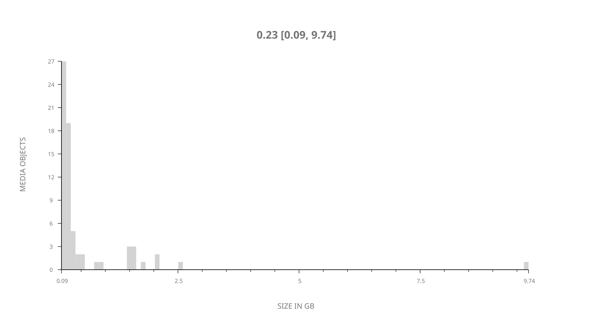
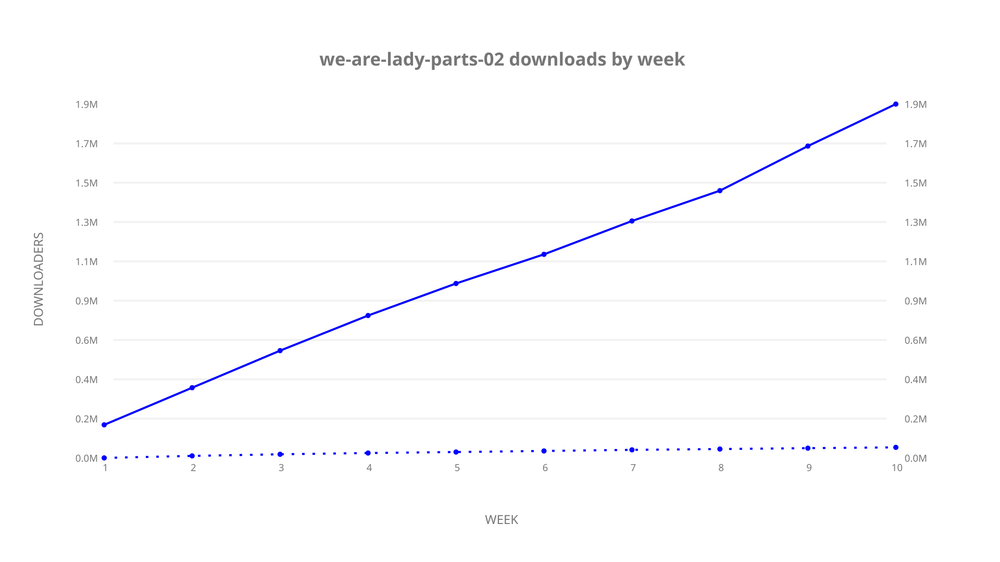
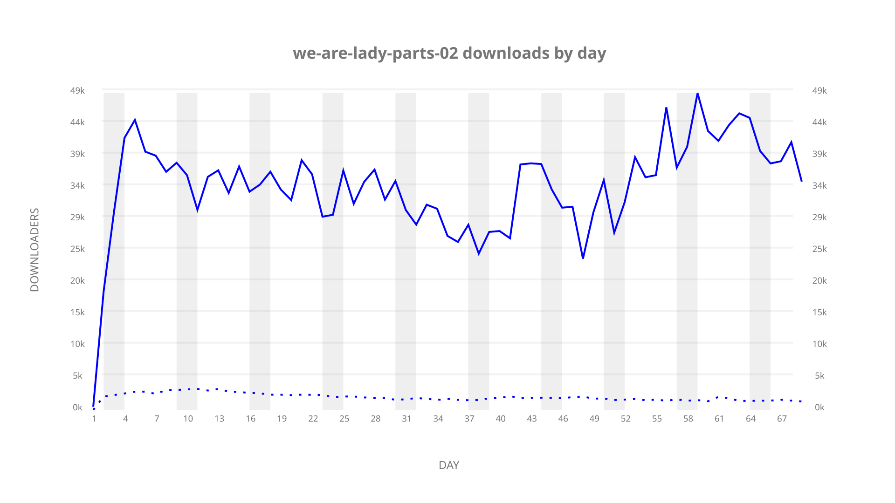
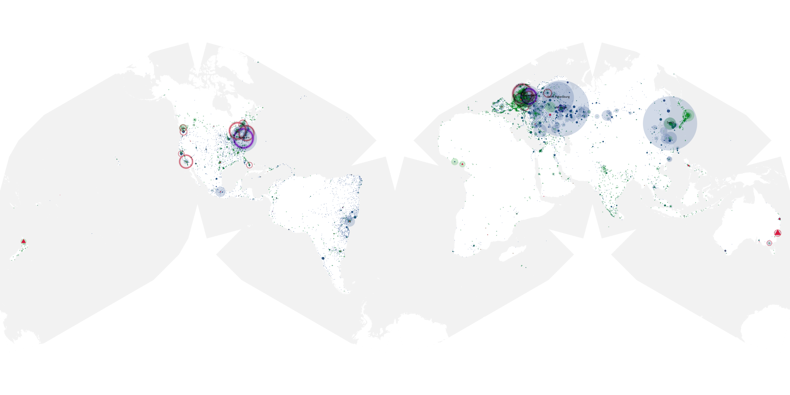
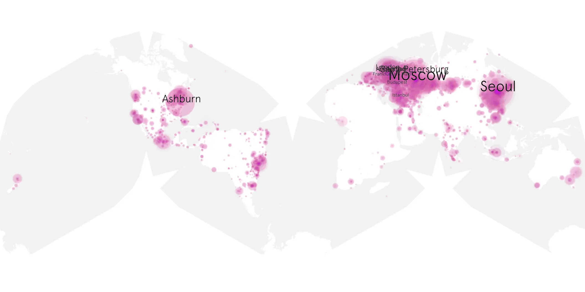
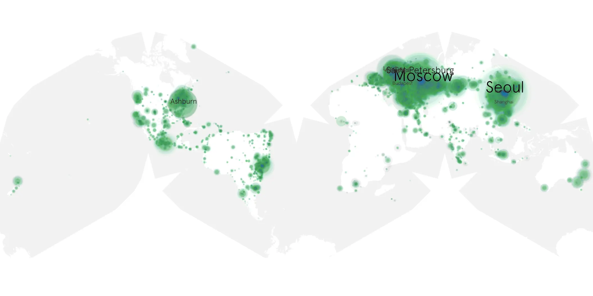

# we-are-lady-parts-02 sample cache audit

## 1. Media object

| Field | Value |
| --- | --- |
| Media object | We Are Lady Parts |
| Collection key | `we-are-lady-parts-02` |
| imdb_id | [tt10846104](https://www.imdb.com/title/tt10846104/) |
| wikipedia_url | UNAVAILABLE |
| Sample dates | 2024-05-30-to-2024-08-07 |
| Sample days | 70 (2024–2024) |
| BTIH count | 78 |
| Unique BTIH count | 68 |
| Downloaders total | 2,047,288 |
| Uploaders total | 77,034 |
| Data version | `2026-08-05` |
| IP geolocation version | `6:1777968300` |

## 2. Cache coverage report

- Generated: 2026-08-28T21:57:24Z
- Sample archive directory: `/run/media/bkoz/gold/src/alpha60-samples-raw.gold/we-are-lady-parts-02.xz`
- Hour directories: 1637
- Zero-length sample files: 0
- Other unparsable sample files: 0
- Hourly discontinuities: 1 (24 missing hours)
- Missing days: 1

### Sample archive discontinuities

- hourly gap: last `2024-07-18 23:03`, resumed `2024-07-20 00:03` — missing 24 hour(s)
- missing day: `2024-07-19`

## 3. Collection size histogram

## 4. Visualization pass — graphs

### Downloads by week cumulative (normalized start)

### Downloads by day, Saturday and Sunday in gray

## 5. Visualization pass — maps

### Continental downloader slices

| Africa | Americas | Asia | Europe | Oceania | Unknown |
| --- | --- | --- | --- | --- | --- |
| 1.03 | 18.85 | 22.68 | 48.24 | 1.24 | 0.63 |

### Cumulative network infrastructure

{:target="_blank" rel="noopener"}

### Cumulative data maps

**Cumulative >= 1080p**

**Cumulative < 1080p**

