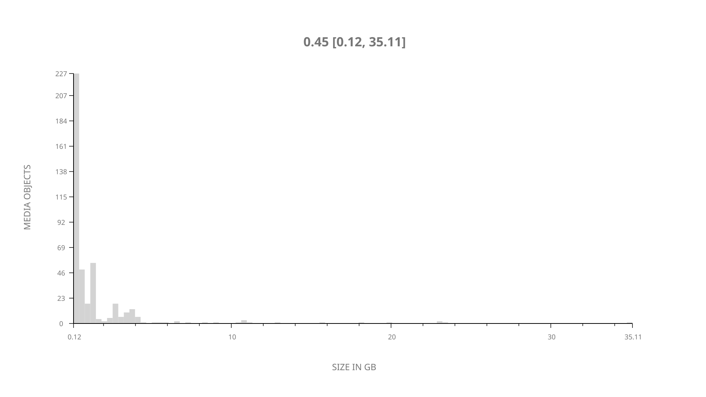
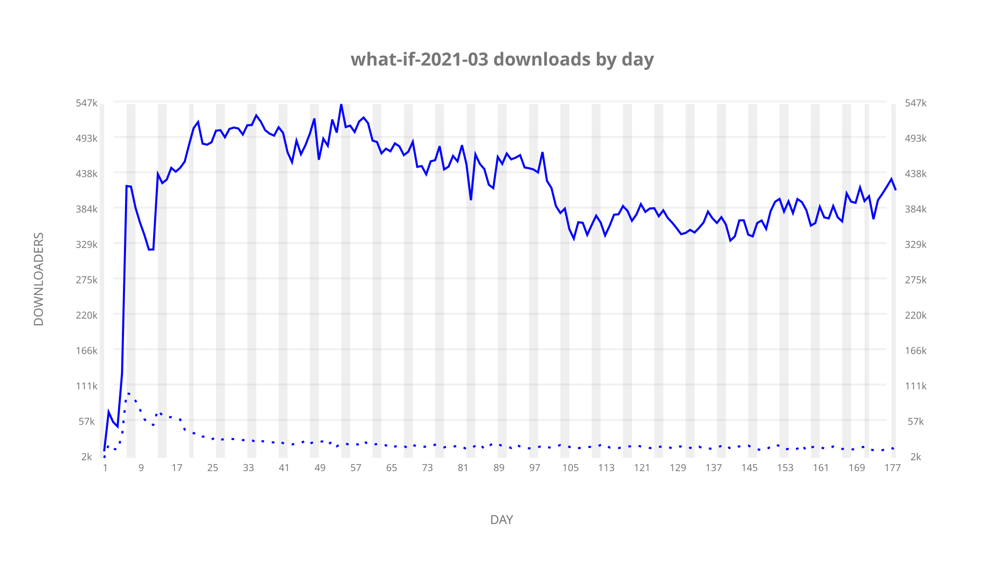
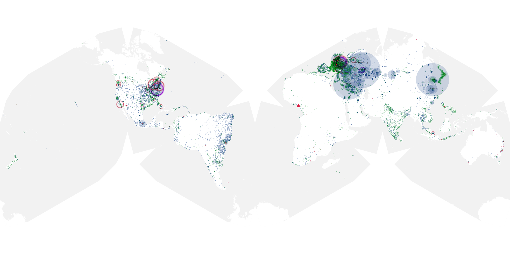
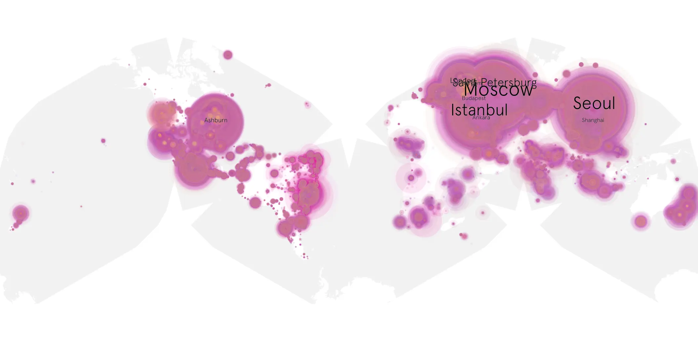
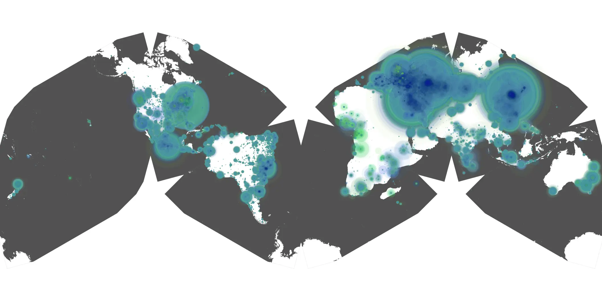

# what-if-2021-03 sample cache audit

## 1. Media object

| Field | Value |
| --- | --- |
| Media object | What if? |
| Collection key | `what-if-2021-03` |
| imdb_id | [tt10168312](https://www.imdb.com/title/tt10168312/) |
| wikipedia_url | [What If...? (TV series)](https://en.wikipedia.org/wiki/What_If...%3F_(TV_series)) |
| Sample dates | 2024-12-22-to-2025-06-21 |
| Sample days | 182 |
| BTIH count | 455 |
| Unique BTIH count | 435 |
| Downloaders total | 58,886,486 |
| Uploaders total | 2,369,461 |
| Data version | `2026-08-05` |
| IP geolocation version | `6:1777968300` |

## 2. Sample coverage report

- Generated: 2026-08-28T21:57:35Z
- Sample archive directory: `/run/media/bkoz/gold/src/alpha60-samples-raw.gold/what-if-2021-03.xz`
- Hour directories: 4241
- Zero-length sample files: 0
- Other unparsable sample files: 0
- Hourly discontinuities: 4 (104 missing hours)
- Missing days: 4

### Sample archive discontinuities

- hourly gap: last `2025-01-10 22:06`, resumed `2025-01-12 01:06` — missing 26 hour(s)
- hourly gap: last `2025-03-14 22:06`, resumed `2025-03-15 03:06` — missing 4 hour(s)
- hourly gap: last `2025-03-30 01:06`, resumed `2025-03-30 03:06` — missing 1 hour(s)
- hourly gap: last `2025-06-11 22:06`, resumed `2025-06-15 00:06` — missing 73 hour(s)
- missing day: `2025-01-11`
- missing day: `2025-06-12`
- missing day: `2025-06-13`
- missing day: `2025-06-14`

## 3. Media objects file size histogram

## 4. Visualization pass — graphs

### Downloads by week cumulative (normalized start)



### Downloads by day, Saturday and Sunday in gray

## 5. Visualization pass — maps

### Cumulative geographic slices

| Africa | Americas | Asia | Europe | Oceania | Unknown |
| --- | --- | --- | --- | --- | --- |
| 1.20 | 15.34 | 28.52 | 52.75 | 0.83 | 0.55 |

### Cumulative network infrastructure

{:target="_blank" rel="noopener"}

### Cumulative data maps

**Cumulative >= 1080p**

{:target="_blank" rel="noopener"}

**Cumulative < 1080p**

{:target="_blank" rel="noopener"}
