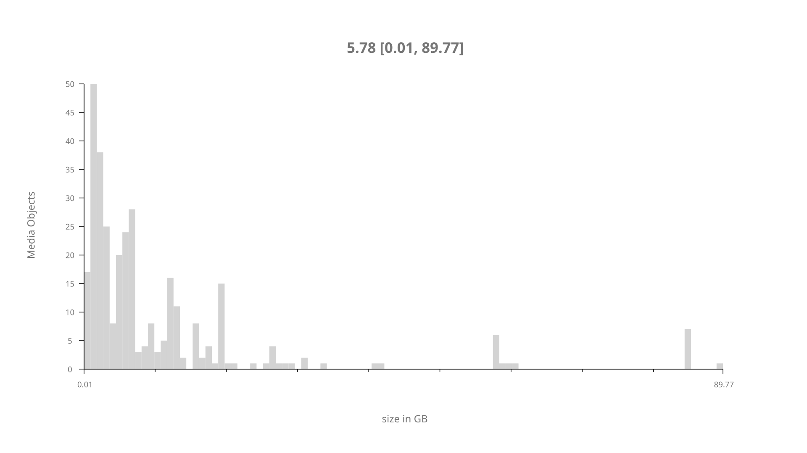
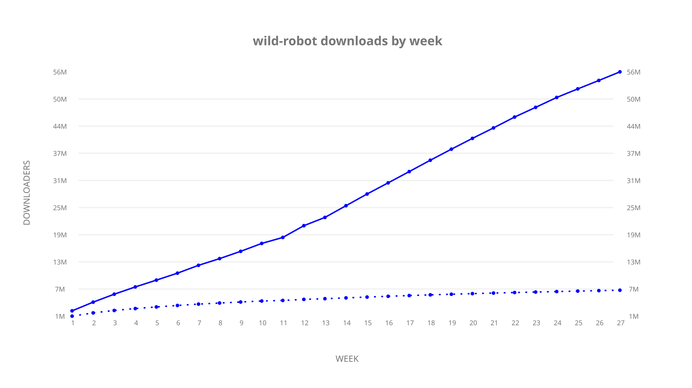
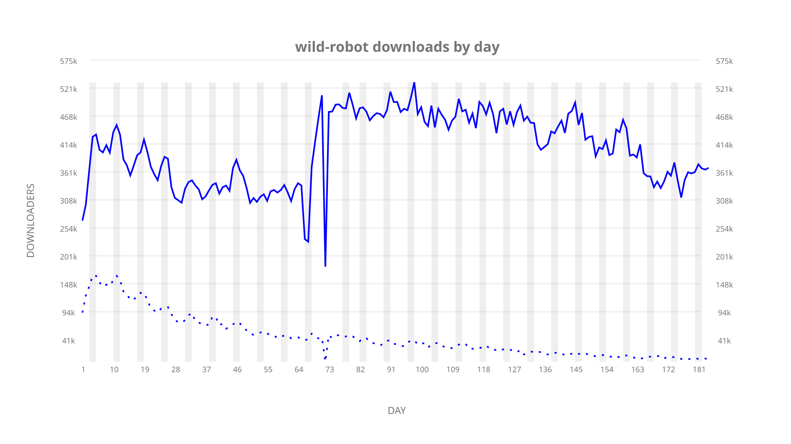
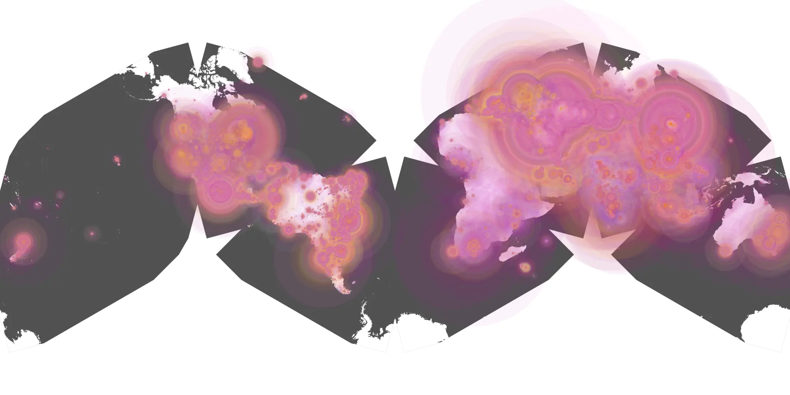
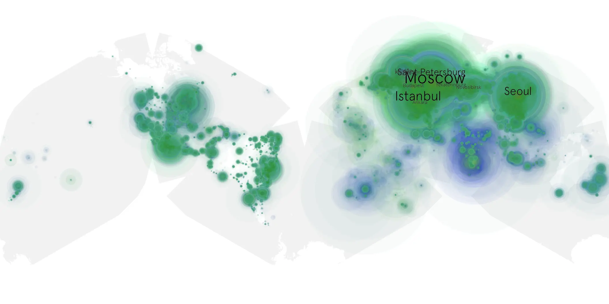

# wild-robot sample cache audit

## 1. Media object

| Field | Value |
| --- | --- |
| Media object | Wild Robot |
| Collection key | `wild-robot` |
| imdb_id | [tt29623480](https://www.imdb.com/title/tt29623480/) |
| wikipedia_url | UNAVAILABLE |
| Sample dates | 2024-10-16-to-2025-04-22 |
| Sample days | 189 (2024–2025) |
| BTIH count | 397 |
| Unique BTIH count | 325 |
| Downloaders total | 69,874,021 |
| Uploaders total | 11,319,543 |
| Data version | `2026-08-05` |
| IP geolocation version | `6:1777968300` |

## 2. Cache coverage report

- Generated: 2026-08-28T21:58:09Z
- Sample archive directory: `/run/media/bkoz/gold/src/alpha60-samples-raw.gold/wild-robot.xz`
- Hour directories: 4400
- Zero-length sample files: 0
- Other unparsable sample files: 0
- Hourly discontinuities: 3 (136 missing hours)
- Missing days: 5

### Sample archive discontinuities

- hourly gap: last `2024-12-26 08:03`, resumed `2024-12-30 00:03` — missing 87 hour(s)
- hourly gap: last `2025-01-07 23:03`, resumed `2025-01-10 00:03` — missing 48 hour(s)
- hourly gap: last `2025-03-30 01:03`, resumed `2025-03-30 03:03` — missing 1 hour(s)
- missing day: `2024-12-27`
- missing day: `2024-12-28`
- missing day: `2024-12-29`
- missing day: `2025-01-08`
- missing day: `2025-01-09`

## 3. Collection size histogram

## 4. Visualization pass — graphs

### Downloads by week cumulative (normalized start)

### Downloads by day, Saturday and Sunday in gray

## 5. Visualization pass — maps

### Continental downloader slices

| Africa | Americas | Asia | Europe | Oceania | Unknown |
| --- | --- | --- | --- | --- | --- |
| 1.93 | 14.79 | 27.49 | 51.00 | 0.91 | 0.56 |

### Cumulative network infrastructure

{:target="_blank" rel="noopener"}

### Cumulative data maps

**Cumulative >= 1080p**

**Cumulative < 1080p**

